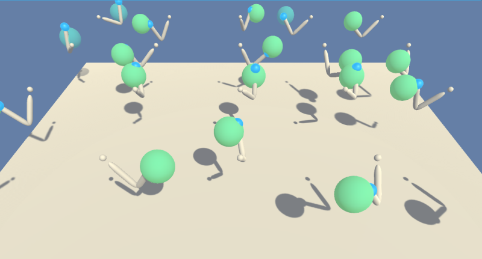
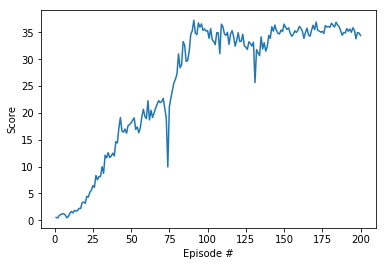

# Continuous Control
## Train an robotic arm to reach target locations by Krasin Georgiev

This report describes an implementation of the **Continuous Control** project from the Udacity's [Deep Reinforcement Learning Nanodegree](https://www.udacity.com/course/deep-reinforcement-learning-nanodegree--nd893) program.  



## Learning Algorithm

The task was solved using the Actor-Critic method Deep Deterministic Policy Gradients (DDPG, [1]). The agent is composed of an Actor and a Critic networks. The Actor network is used to calculate the action based on the current state. The Critic network is used to predict the Q-value, i.e. the value of the current (state, action). The negative of the Q-value is used as a loss measure for training the Actor network. To measure the loss of the Critic network, a "true" or target Q-value is calculated using the Bellman equation, which in pseudocode looks like `Q_targets = rewards + gamma * critic_target(next_states, actions_next)`

### The Actor network

The Actor network used three fully connected layers. The first and the second hidden layers had 400 and 300 activations respectively. The non-linearity in all layers but the last was ReLU. For the last layer it was **tanh** to provide an output between -1 and 1.

The input to the Actor network is the state defined by 33 continuous values corresponding to observations. The output is the action defined by 4 continuous values corresponding to torques applied at the joints.

### The Critic network

The Critic network used three fully connected layers. The output of the last layer was single number - the Q-value. 

The input to the first layer was the state (33 units) and the output had 400 activations. The input to the second layer was the output of the first layer concatenated with the action input (4 units). The output of the second layer had 300 units.

### Training

The training algorithm is implemented in the function `ddpg()`. The interaction with the envoronment is similar to the one from [the previons project](https://github.com/krasing/DRLearningNavigation/blob/master/Report.ipynb). The differences are in the agent as defined in `class Agents()` based on the algorithm in [2]:
 - at each step the experience from all agents is collected into the buffer memory. Then a sample from the memory is taken and the learning method `self.learn(experiences, GAMMA)` is called
 - the action function `act()` infolves calculation of the action for all agents. The local Actor network `actor_local(state)` is called in a loop. Additional noise of class `OUNoise()` is added to explore the action space.

### Learning

Learning is performed by the `learn()` method of the `Agent()` class.
The loss function and the gradient propagations worth further consideration. Explore how this implementation in code corresponds to *Algorithm 1* in [1]. (More explanations to be added here!)

in `_init__()`:
``` python
self.actor_optimizer = optim.Adam(self.actor_local.parameters(), lr=LR_ACTOR)
self.critic_optimizer = optim.Adam(self.critic_local.parameters(), lr=LR_CRITIC, weight_decay=WEIGHT_DECAY)
```

in `learn()`:
```python
    # ---------------------------- update critic ---------------------------- #
    # Compute critic loss
    Q_expected = self.critic_local(states, actions)
    critic_loss = F.mse_loss(Q_expected, Q_targets)
    # Minimize the loss
    self.critic_optimizer.zero_grad()
    critic_loss.backward()
    self.critic_optimizer.step()
```

``` python
    # ---------------------------- update actor ---------------------------- #
    # Compute actor loss
    actions_pred = self.actor_local(states)
    actor_loss = -self.critic_local(states, actions_pred).mean()
    # Minimize the loss
    self.actor_optimizer.zero_grad()
    actor_loss.backward()
    self.actor_optimizer.step()
```

### Hyperparameters

I have not played with the dafault training hyperparameters:

    BUFFER_SIZE = int(1e5)  # replay buffer size
    BATCH_SIZE = 128        # minibatch size
    GAMMA = 0.99            # discount factor
    TAU = 1e-3              # for soft update of target parameters
    LR_ACTOR = 1e-4         # learning rate of the actor 
    LR_CRITIC = 1e-3        # learning rate of the critic
    WEIGHT_DECAY = 0        # L2 weight decay

The neural network parameters were not optimized also.

## Plot of Rewards

A plot below shows that the agent is able to receive an average reward (over 100 episodes, and over all 20 agents) of about +35. The required performance of +30 is achieved after 80 episodes.



The training was performed for 200 episodes and took 65 minutes. The "bottlneck" of the computations seems to be the sampling from the `ReplayBuffer`. Increase of the `BATCH_SIZE` improved the learning per episode but increased significantly the processing time per episode. As the cumulative effect was slower learning the initial `BATCH_SIZE = 128` was preserved.

## Ideas for Future Work

The agent's performance could be further improved by using standard techniques for better neural network training:
 - continue the training with reduced learning rates `LR_ACTOR` and `LR_CRITIC`
 - increase the `BATCH_SIZE` by two orders of magnitude (very slow at the current implementation)
 - add dropout layers or other forms of regularization in the model;
 - try more layers or more activations per layer

In addition completely different deep reinforced learning algorithms applicable for continuous control tasks can be explored (e.g. see [3])

## References

1. Lillicrap T.P., Hunt J.J., Pritzel A., et.al., Continuous control with deep reinforcement learning, arXiv:1509.02971v5, https://arxiv.org/abs/1509.02971

2. Implementations of the **Deep Deterministic Policy Gradients**: https://github.com/udacity/deep-reinforcement-learning/tree/master/ddpg-pendulum): Use OpenAI Gym's Pendulum environment.

3. Yan Duan, Xi Chen, Houthooft R., Schulman J., Abbeel P., Benchmarking Deep Reinforcement Learning for Continuous Control, [arXiv:1509.02971](https://arxiv.org/abs/1604.06778).
